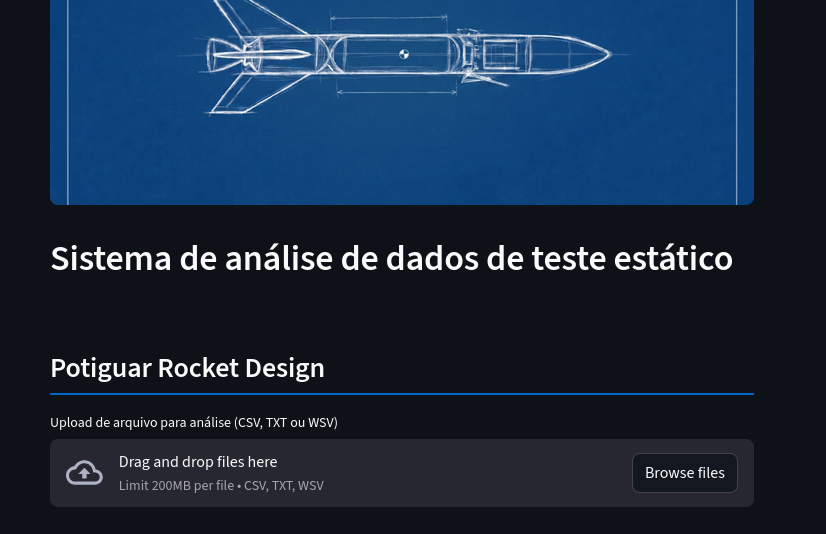
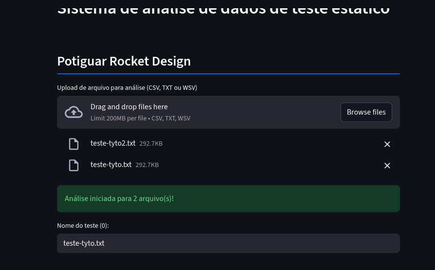
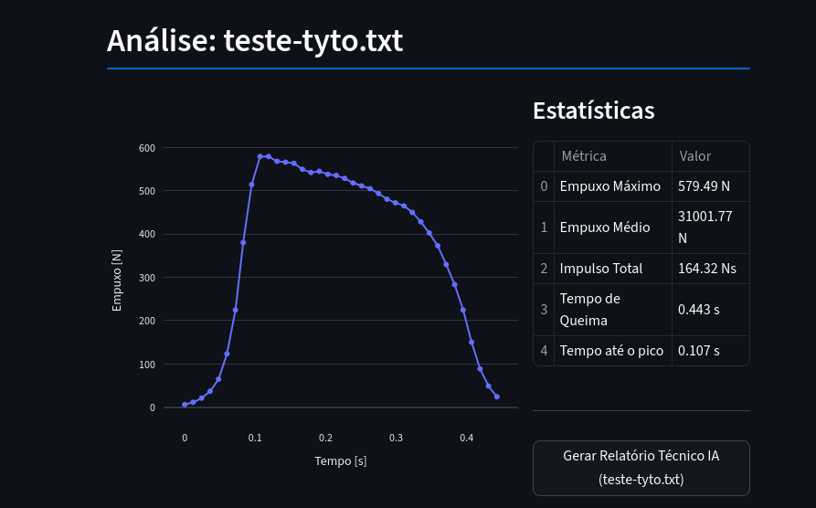
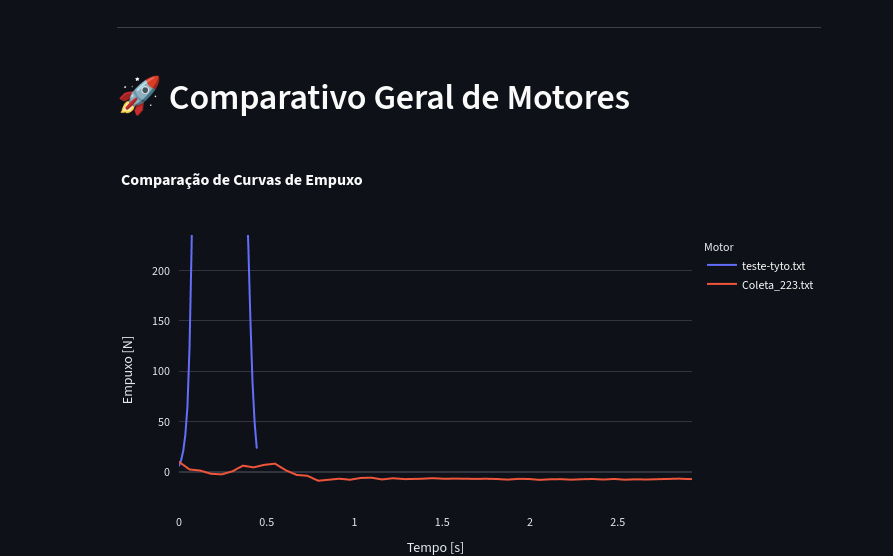

# Rocket Motor Static Test Data Analysis - PRD 🚀

[](https://www.python.org/)
[](https://streamlit.io/)
[](https://deepmind.google/technologies/gemini/)

An advanced application developed for **Potiguar Rocket Design (PRD)** to analyze and visualize data from static rocket motor tests. This tool transforms raw load cell data into actionable engineering insights using modern data science libraries and Artificial Intelligence.

---

## ✨ Key Features

- **Multi-Format Upload:** Supports `.csv`, `.txt`, and `.wsv` raw data files.
- **Smart Burn Detection:** Automatically identifies the ignition and burnout points using thrust thresholding.
- **Interactive Visualizations:** High-fidelity thrust-time curves powered by Plotly.
- **Automated Engineering Metrics:**
  - **Maximum & Average Thrust (N)**
  - **Total Impulse (Ns)**
  - **Burn Time (s)**
  - **Time to Peak (s)**
- **AI-Powered Technical Reports:** Integrates with **Google Gemini 2.0 Flash** to provide concise technical analysis of motor efficiency.
- **Comparative Analysis:** Compare multiple motor tests side-by-side in a single unified chart.
- **Export Ready:** Generate and download high-quality PNG tables of test statistics.

---

## 🛠️ Technologies Used

- **Streamlit:** Interactive web interface.
- **Plotly:** Dynamic and interactive charting.
- **NumPy & Pandas:** Data processing and numerical analysis.
- **Google GenAI (Gemini API):** Intelligent technical reporting.
- **Python-dotenv:** Secure environment variable management.

---

## 🖥️ Usage Guide

### 1. File Upload
Upload one or more files containing your test data. The app will process each file individually and offer a comparison if multiple files are uploaded.

 > 
 ...
 > 

### 2. Data Calibration & Results
The system automatically applies calibration factors and filters noise. You will see an interactive graph and a summary table for each motor.

 > 

### 3. Comparative View
When analyzing multiple motors, a consolidated chart at the bottom allows for direct performance comparison.

 > 


### Bulding AI analisisys...
---

## 📦 Installation & Setup

1. **Clone the repository:**
   ```bash
   git clone https://github.com/Sonryu/prd_data_analysis.git
   cd prd_data_analysis
   ```

2. **Set up a virtual environment:**
   ```bash
   python -m venv venv
   source venv/bin/activate  # On Windows: venv\Scripts\activate
   ```

3. **Install dependencies:**
   ```bash
   pip install -r requirements.txt
   ```

4. **Environment Variables:**
   Create a `.env` file in the root directory and add your Gemini API Key (optional):
   ```env
   GOOGLE_API_KEY=your_key_here
   ```

5. **Run the application:**
   ```bash
   streamlit run app.py
   ```

---

## 📄 License

Copyright (c) 2026 Ramon Watson de Lima Vilar.
This project is licensed under the **MIT License**. See the `LICENSE` file for full details.
